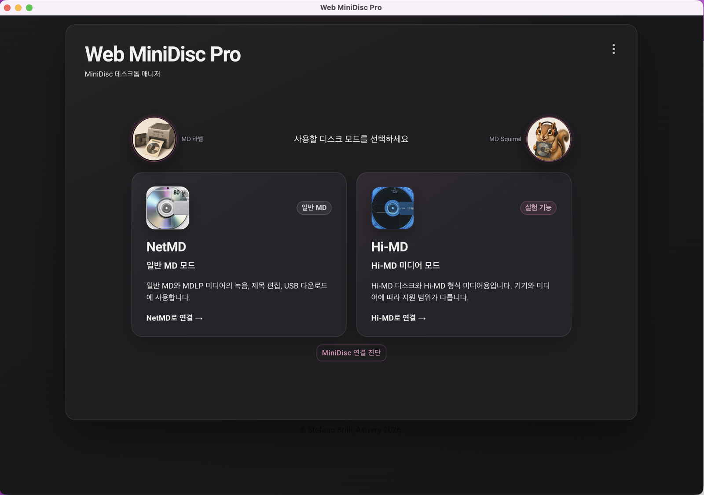

# Web MiniDisc Pro Custom

Unofficial, non-commercial Windows and Intel macOS builds of
[ElectronWMD](https://github.com/asivery/ElectronWMD) and
[Web MiniDisc Pro](https://github.com/asivery/webminidisc), focused on
NetMD/Hi-MD device support, platform-specific improvements, and an integrated
WinUSB installation flow on Windows.

> This repository is not an official release of ElectronWMD, Web MiniDisc Pro,
> Sony, or MiniDisc.wiki. Back up important recordings before testing.

## Why this project exists

This project was created for MiniDisc users who find Hi-MD connection and
audio transfer difficult or unreliable in browser-based environments and who
prefer not to depend on the discontinued SonicStage software. Its goal is to
provide a practical desktop workflow for connecting devices, transferring
personally owned audio, editing metadata, and managing NetMD and Hi-MD media on
Windows and macOS.

On macOS, some Sony Hi-MD devices cannot expose the required USB interface
through the normal browser or libusb path because macOS claims their storage
interface. The Intel macOS build adds a native USB helper and, for supported
firmware, a temporary RAM patch that makes practical Hi-MD access possible
without depending on SonicStage. The patch is volatile and disappears when the
device is fully powered off.

이 프로젝트는 브라우저 기반 환경에서 운영체제와 기기에 따라 Hi-MD 연결과
음악 전송이 어렵거나 안정적이지 않고, 더 이상 유지보수되지 않는 SonicStage에
의존하고 싶지 않은 MiniDisc 사용자를 위해 시작되었습니다. Windows와 macOS에서
기기를 연결하고, 사용자가 소유한 음원을 전송하며, 제목을 편집하고 NetMD 및
Hi-MD 미디어를 관리할 수 있는 실용적인 데스크톱 환경을 제공하는 것이 목표입니다.

macOS에서는 일부 Sony Hi-MD 기기의 저장장치 인터페이스를 운영체제가 점유하여
일반적인 브라우저 또는 libusb 방식으로 필요한 USB 인터페이스에 접근하기 어렵습니다.
Intel macOS 빌드는 이를 위해 네이티브 USB 도우미와 지원되는 펌웨어용 임시 RAM
패치를 추가하여 SonicStage 없이도 Hi-MD를 실용적으로 사용할 수 있게 했습니다.
RAM 패치는 휘발성이므로 기기의 전원이 완전히 꺼지면 사라집니다.

## Status

The source and GitHub Actions build pipeline are public. Web MiniDisc Pro 1.5.4
— Windows Custom R7 is available from the
[Windows Custom R7 release](https://github.com/run240/web-minidisc-pro-custom/releases/tag/windows-v1.5.4-r7)
as a portable x64 ZIP. The current portable build is unsigned; open-source
code-signing is not currently active. A SignPath-compatible workflow is
included for possible future use, but no signing certificate has been issued
to this project.

The tested Intel macOS (`x64`) v12 DMG is available from the
[Intel macOS Hi-MD v12 release](https://github.com/run240/web-minidisc-pro-custom/releases/tag/macos-intel-himd-v12).
It supports NetMD and Hi-MD through the native macOS USB stack, including a
volatile RAM-patch path for Sony Hi-MD devices whose normal storage interface is
claimed by macOS. Apple Silicon is not currently packaged or supported.

## Windows Custom 안내

1. 위 Windows Custom R7 릴리스에서 x64 ZIP과 SHA-256 파일을 받습니다.
2. 해시를 확인한 뒤 ZIP을 새 폴더에 완전히 압축 해제합니다.
3. `Web MiniDisc Pro.exe`를 실행합니다.
4. 기기를 연결하고 NetMD 또는 Hi-MD 모드를 선택합니다.

Windows용 WinUSB 설치 과정, 자체 서명 테스트 드라이버 인증서, 변경 취소
방법은 [Windows 빌드 및 설치 안내](docs/WINDOWS.md)를 먼저 확인해 주세요.

## Intel macOS Hi-MD v12 안내



### 주요 기능

- NetMD 녹음, 제목·그룹 편집, 트랙 내려받기
- Hi-MD/1GB Hi-MD 미디어 읽기, 편집, 삭제 및 음악 전송
- FLAC/WAV 변환 전송과 Hi-MD PCM 전송
- Sony Hi-MD 호환 펌웨어의 임시 RAM 패치 및 USB 클래스 우회
- 기존 미디어를 지우지 않는 **RAM 패치만 적용** 절차
- 일반 60/74/80분 MD를 Hi-MD 형식으로 포맷하거나 다시 NetMD로 초기화
- USB 점유·전송 지연·장치 정보를 1만 자 이내로 복사하는 연결 진단
- 한국어 안내, 포맷 확인창, 99% 마무리 구간 및 오류 복구 안내

### 설치

1. 위 v12 릴리스에서 `WMDP Intel Hi-MD RAM Patch v12.dmg`를 받습니다.
2. DMG를 열고 `Web MiniDisc Pro.app`을 `Applications`로 드래그합니다.
3. 최초 실행은 Finder의 응용 프로그램에서 앱을 **Control-클릭 → 열기**로 실행합니다.
4. Hi-MD 연결 시 macOS 관리자 암호 창이 나오면 허용합니다.

이 DMG는 Apple Developer ID 공증을 받지 않은 개인용 오픈소스 빌드입니다.
자세한 미디어 교체·RAM 패치·포맷 순서는
[Intel Mac Hi-MD 사용 설명서](docs/INTEL_MAC_HIMD_GUIDE_KO.md)를 먼저 읽어주세요.

### 원본 ElectronWMD와의 차이

| 항목 | 원본 ElectronWMD | 이 Intel macOS v12 빌드 |
| --- | --- | --- |
| macOS Hi-MD USB | 일반 libusb/대용량 저장장치 경로 | IOUSBHost 기반 native helper와 Apple 드라이버 점유 진단 |
| Sony Hi-MD 모드 전환 | 기기·OS 상태에 따라 수동 복구 필요 | 호환 펌웨어 확인 후 임시 RAM 패치와 USB 클래스 우회 |
| 기존 Hi-MD 미디어 | 연결 모드가 맞아야 접근 | 일반 MD에서 패치만 적용한 뒤, 전원을 유지하고 미디어 교체 가능 |
| 일반 MD 포맷 | 기본 포맷 기능 | 패치만 적용과 전체 삭제 포맷을 분리하고 진행 상태 표시 |
| 오류 처리 | 원래 오류창과 개발자 로그 중심 | 한국어 복구 안내, 제한 시간, 재연결 정리, 진단 정보 복사 |
| 검증 범위 | 업스트림 범용 지원 | MZ-NH1은 Intel Sonoma/Tahoe, MZ-RH10은 Intel Tahoe에서 실기 검증 |

RAM 패치는 기기 전원이 완전히 꺼지면 사라지지만 미디어의 음악은 지우지 않습니다.
반면 `일반 MD를 지우고 Hi-MD로 포맷`과 NetMD 초기화는 실제로 모든 곡을 삭제합니다.

## Main changes

- Integrated WinUSB installation flow based on a reviewed driver package derived from libwdi 1.5.1
- NetMD and Hi-MD connection and mode diagnostics
- Automatic RH1 NetMD/Hi-MD USB interface switching without replugging
- Automatic mode reconnection after the application restarts
- Multiple connected-device selection
- MiniDisc disc, case, and spine label designer with PDF, PNG, SVG, and project export
- Import the track list already loaded from a connected NetMD or Hi-MD into a label
- Korean UI and filename romanization improvements
- MD Squirrel assistant for creating English-tagged copies of local audio
- Apple Music (US) metadata lookup for English track and artist names, with
  duration-aware candidates and a manual web-search fallback
- Original audio preservation: copies are written to a sibling `[English]`
  folder without re-encoding
- Hi-MD and NetMD temporary metadata editing
- Batched title, album, artist, order, group, and disc-name editing with post-write verification
- Hi-MD connection-state cleanup and safer timeout recovery
- Transfer-stall diagnostics and troubleshooting information
- Windows-focused theme, icons, loading screen, dialogs, and context menus,
  including light-theme text contrast fixes
- Window position and monitor restoration across mode changes
- Intel macOS NetMD/Hi-MD connection, recording, upload, and USB-mode switching
- Intel macOS conversion of standard 60/74/80-minute MD media between NetMD and
  Hi-MD formats, with destructive-operation confirmations
- Native macOS administrator authorization without opening Terminal windows
- Native macOS whole-device capture for Hi-MD units whose mass-storage
  interface cannot be released reliably through libusb alone
- Non-destructive RAM-patch-only preparation for swapping to an existing Hi-MD
  disc without formatting the standard MD used to enter NetMD mode
- Firmware-capability-based RAM patching validated on Sony MZ-NH1 and MZ-RH10
- Compact copyable connection diagnostics designed for chat-based support

## Screenshots

### Windows home and mode selection


### MiniDisc label maker


## Community testing and reviews

The Windows custom build has been independently tested by members of a Korean
MiniDisc community using multiple Sony NetMD and Hi-MD devices. Reports include
real-world connection, recording, mode-switching, metadata-editing, and
troubleshooting feedback across several releases.

- [Independent Web MiniDisc Pro V6 user review and discussion](https://naver.me/5xg77Ent)
  (Korean; Naver Cafe membership may be required to view the full post)

## Source layout

- `src/`: ElectronWMD source
- `webminidisc/`: pinned Web MiniDisc Pro submodule
- `third_party/libwdi/`: complete libwdi source used as the basis for the WinUSB driver package
- `custom-overrides/`: exact Windows Custom R7 generated-file modifications and label-maker assets
- `.github/workflows/build-signpath.yml`: Windows build, release packaging, and optional SignPath submission
- `signpath-artifact-configuration.xml`: Authenticode signing scope

Base revisions:

- ElectronWMD: `a3f30f8ae3bb022aa8aa58776dc7e473c09ad066`
- Web MiniDisc Pro: `30c3045155a1c057171506aaf3ffee64552df679`

The current Windows Custom R7 modifications were originally made against generated output.
They are kept as a transparent build overlay so the existing release can be
reproduced. Future changes should be moved into the TypeScript/React sources
where practical.

The complete reviewed renderer bundle is stored under `custom-overrides/renderer`.
This includes the worker scripts, fonts, WASM files, and image assets required
for offline and GitHub Actions builds.

## Building on Windows

Requirements:

- Node.js 20
- Visual Studio 2022 Build Tools with Desktop development with C++
- Windows 10 or Windows 11 SDK

From an x64 Native Tools Command Prompt:

```powershell
npm ci --legacy-peer-deps
third_party\libwdi\build-wmdp-helper.cmd
npm run pack:custom
```

The unpacked application is written to `build\win-unpacked`.

## Building on Intel macOS

Requirements:

- Intel Mac
- Node.js 20 or newer
- Xcode Command Line Tools

```bash
npm install --legacy-peer-deps
node scripts/build-custom.mjs
npx electron-builder --mac dmg --x64 --publish never
```

The DMG is written under `build/`. The distributed app is currently unsigned,
so macOS may require Control-clicking the app and choosing **Open** on first run.
Hi-MD access displays the standard macOS administrator authorization dialog.

### macOS media-format warning

Formatting erases every track and title on the disc. Only standard
60/74/80-minute MD media can be converted back to NetMD format; 1 GB Hi-MD-only
media cannot. Back up irreplaceable recordings and test with expendable media
before using format or mode-conversion controls.

The current RAM-patch path is selected by firmware capability rather than a
single product ID. The final v12 workflow has been tested with Sony MZ-NH1 on
Intel macOS Sonoma and Tahoe, and with MZ-RH10 on Intel macOS Tahoe. Validation
includes PCM upload, playback, mode changes, existing Hi-MD media, and
standard-MD Hi-MD formatting. Other listed Sony Hi-MD models remain
community-test candidates. See the
[Intel Mac Hi-MD guide](docs/INTEL_MAC_HIMD_GUIDE_KO.md),
[v12 release notes](docs/MACOS_INTEL_HIMD_V12_RELEASE_NOTES_KO.md), and
[native transport work log](docs/MACOS_HIMD_NATIVE_CAPTURE_WORKLOG.md).

For the signing workflow and SignPath configuration, see
[PUBLIC-SIGNING.md](PUBLIC-SIGNING.md).

## Code signing policy

The project's code-signing roles, privacy statement, release approval process,
and Windows system-change policy are documented in
[CODE-SIGNING-POLICY.md](CODE-SIGNING-POLICY.md).

The repository includes a policy and workflow prepared for possible future
SignPath Foundation signing. Current release binaries remain unsigned.

## License and credits

ElectronWMD and Web MiniDisc Pro are distributed under the GNU General Public
License version 2. The embedded WinUSB helper is derived from
[libwdi](https://github.com/pbatard/libwdi), licensed under the GNU Lesser
General Public License version 3 or later.

Original work and contributions belong to Stefano Brilli, Asivery, Pete Batard,
and the respective upstream project contributors.

This software is provided without warranty.
