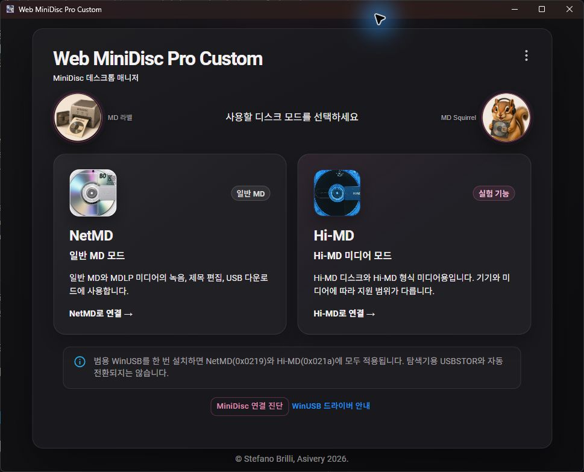
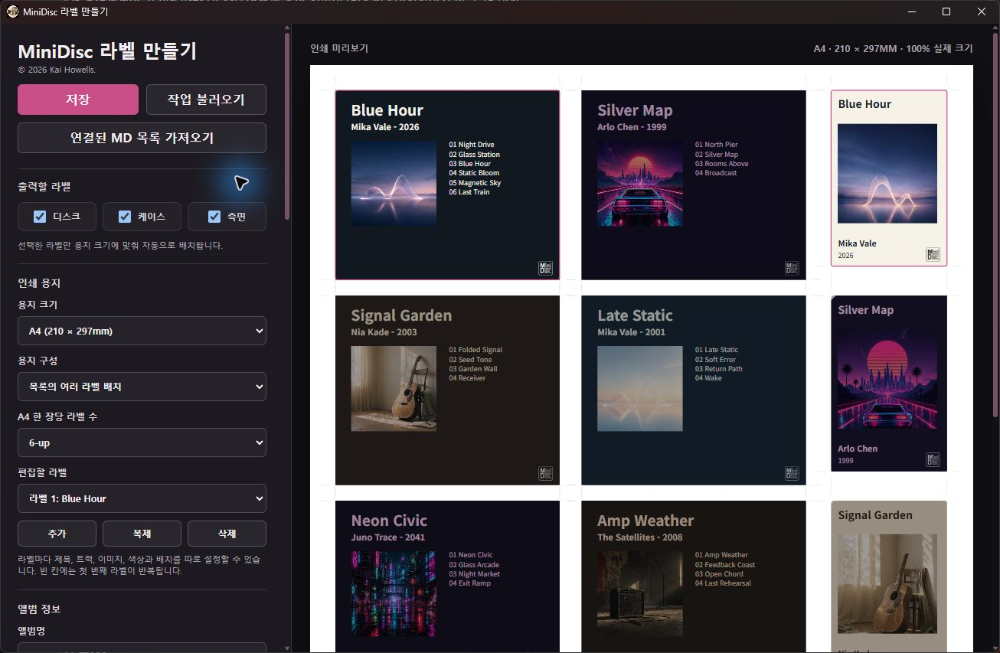

# Windows 사용 안내

[English guide](WINDOWS_EN.md)

이 문서는 Web MiniDisc Pro Custom의 Windows 설치, WinUSB 드라이버, NetMD와
Hi-MD 연결, 녹음 마무리, 오류 복구와 소스 빌드를 한곳에 정리한 안내서입니다.



## 현재 배포 상태

- 지원 운영체제: Windows 10 또는 Windows 11, x64
- 마지막 공개 ZIP: [Windows Custom R8](https://github.com/run240/web-minidisc-pro-custom/releases/tag/windows-v1.5.4-r8)
- 배포 형식: 설치 프로그램이 아닌 포터블 ZIP
- 서명 상태: 앱 실행 파일은 현재 Authenticode 코드 서명되지 않음

R8 태그 뒤에 `main` 브랜치에는 새 아이콘, 보안 런타임 갱신, 시작 화면 안정화와
Windows MZ-RH10 Hi-MD 마무리 보정이 추가되었습니다. 새 Windows 릴리스가
게시되기 전까지 R8 ZIP과 현재 `main`의 내용은 같지 않습니다.

## 시작하기 전에

- 중요한 디스크는 먼저 백업합니다.
- 녹음, 편집 적용, 포맷 중에는 충분한 배터리나 안정적인 외부 전원을 사용합니다.
- 가능하면 USB 허브를 거치지 말고 데이터 전송이 되는 케이블로 PC 본체 포트에
  직접 연결합니다.
- SonicStage, OpenMG, 다른 MiniDisc 프로그램과 파일 탐색기에서 해당 기기를
  사용 중이라면 종료합니다.
- `99%`, `REC` 점멸, 포맷 진행 중에는 USB와 전원을 분리하지 않습니다.

## 다운로드 및 실행

1. GitHub Releases에서 Windows x64 ZIP과 같은 이름의 SHA-256 파일을 받습니다.
2. SHA-256 파일에 적힌 값과 다운로드한 ZIP의 해시를 비교합니다.
3. ZIP을 새 폴더에 완전히 압축 해제합니다. ZIP 안에서 EXE를 직접 실행하지 않습니다.
4. `Web MiniDisc Pro.exe`를 실행합니다.
5. 화면 오른쪽 위 메뉴의 **Settings/설정 → Language/언어**에서 `한국어`,
   `English` 또는 시스템 언어 자동 선택을 지정할 수 있습니다.

PowerShell에서 해시를 확인하는 예:

```powershell
Get-FileHash -Algorithm SHA256 '.\Web-MiniDisc-Pro-*-Windows-x64.zip'
```

SmartScreen 또는 Smart App Control이 실행을 차단할 수 있습니다. 출처와 해시를
확인하지 않은 파일은 실행하지 마세요. 이 앱 하나를 실행하기 위해 Windows 보안
기능 전체를 끄는 방법은 권장하지 않습니다.

## WinUSB 드라이버 이해하기

NetMD와 Hi-MD 기기를 이 앱에서 사용하려면 현재 USB 인터페이스에 Windows의
WinUSB 드라이버가 연결되어 있어야 합니다. 앱은 연결한 기기의 USB ID와 현재
드라이버를 검사하고, WinUSB가 없을 때만 설치를 제안합니다.

설치에 동의하면 앱은 Windows 기본 도구인 `certutil.exe`와 `pnputil.exe`를
관리자 권한으로 실행합니다. 번들 드라이버 카탈로그 검증을 위해 자체 서명된
`Web MiniDisc Pro WinUSB Test Driver` 인증서가 로컬 컴퓨터의 루트 및 신뢰할
수 있는 게시자 인증서 저장소에 추가됩니다. 이어서 지원되는 MiniDisc USB ID가
포함된 드라이버 패키지가 Windows 드라이버 저장소에 등록됩니다.

알아둘 점:

- 범용 패키지 한 번으로 지원 USB ID를 등록하지만, 기기가 다른 USB 모드로 처음
  나타날 때 Windows가 드라이버를 적용하고 재연결하는 시간이 필요할 수 있습니다.
- MZ-RH10처럼 NetMD와 Hi-MD가 서로 다른 USB ID(`0x0219`, `0x021a`)로 나타나는
  기기는 선택한 모드가 맞는지 화면의 기기 정보로 확인합니다.
- WinUSB를 사용하는 동안 Hi-MD 저장장치가 파일 탐색기의 일반 USB 드라이브로
  동시에 열리지는 않습니다. 탐색기용 `USBSTOR`와 앱용 WinUSB는 자동 전환되지
  않습니다.
- 설치 중 UAC 창이 나타나면 대상과 게시자 안내를 확인한 뒤 사용자가 직접 허용합니다.
- 설치 중에는 USB 케이블을 분리하지 않습니다.

## 처음 연결하기

1. MiniDisc 기기에 미디어를 넣고 USB로 연결합니다.
2. 일반 MD/MDLP 미디어는 **NetMD로 연결**, Hi-MD 형식 미디어와 1GB Hi-MD
   전용 미디어는 **Hi-MD로 연결**을 선택합니다.
3. 여러 기기가 연결되어 있으면 모델명과 USB 위치를 보고 사용할 기기 하나를 고릅니다.
4. WinUSB 안내가 나타나면 현재 기기, 모드와 USB ID를 확인하고 설치합니다.
5. 모드 전환이나 드라이버 적용으로 앱이 다시 시작되면 기기가 다시 표시될 때까지
   기다립니다. 필요하면 케이블을 한 번 다시 연결하고 같은 모드를 선택합니다.

홈 화면의 **MiniDisc 연결 진단**은 연결된 모델, USB ID, USB 위치, 감지된 모드와
드라이버 상태를 확인할 때 사용합니다.

## NetMD 사용

NetMD는 일반 60/74/80분 MD와 MDLP 미디어의 녹음, 제목·그룹 편집, 트랙
내려받기에 사용합니다.

1. 일반 MD를 넣고 **NetMD로 연결**을 선택합니다.
2. 디스크 목록이 표시되면 음원 파일을 추가하고 지원되는 녹음 형식을 선택합니다.
3. 녹음이 끝나고 디스크 TOC 반영이 완료될 때까지 기기를 분리하지 않습니다.
4. 제목, 그룹 또는 순서를 임시 편집한 경우 **적용** 후 실제 디스크를 다시 검색해
   결과를 확인합니다.

Hi-MD 형식 디스크를 NetMD로 열면 비어 있는 디스크처럼 보일 수 있습니다. 그
상태에서 녹음을 시작하면 미디어 형식이 바뀌어 기존 Hi-MD 데이터가 사라질 수
있으므로, 미디어 형식이 확실하지 않으면 먼저 취소하고 Hi-MD로 다시 연결합니다.

## Hi-MD 사용

Hi-MD는 Hi-MD 형식으로 포맷된 일반 MD와 1GB Hi-MD 전용 미디어의 목록,
편집, 삭제와 음악 전송에 사용합니다.

1. Hi-MD 형식 미디어를 넣고 **Hi-MD로 연결**을 선택합니다.
2. 파일시스템과 트랙 목록이 표시될 때까지 기다립니다.
3. 음원 변환과 데이터 전송이 끝난 뒤에도 메타데이터, FAT와 ICV 인증 정보가
   확정될 때까지 기기가 계속 작업할 수 있습니다.
4. 완료 표시가 나온 뒤 트랙 목록과 실제 재생을 확인합니다.

### 99%에서 오래 기다리는 이유

화면의 파일 변환 100%와 MD 전송 99%는 같은 의미가 아닙니다. 99%에서는 오디오
데이터 뒤에 트랙 데이터베이스, 파일시스템과 ICV 정보를 확정합니다. MZ-RH10
실기에서는 이 최종 단계가 약 50초 걸린 사례가 확인되었습니다.

- `REC`가 점멸하거나 기기가 동작 중이면 **조금 더 대기**합니다.
- 전송 정지 안내가 나타나면 **진단 정보 복사**로 화면과 USB 정보를 저장합니다.
- 자동 재시도는 이미 반영된 최종 명령을 중복 실행할 수 있어 앱이 수행하지 않습니다.
- 오류 후에는 USB를 다시 연결하고 트랙이 이미 등록됐는지 확인한 뒤 재전송합니다.
- 현재 `main`에는 Windows MZ-RH10의 느린 Hi-MD 최종 응답을 최대 60초 기다리는
  보정이 포함되어 있습니다.

## 미디어 형식과 포맷

모드 전환과 포맷은 다릅니다.

- **NetMD/Hi-MD로 전환만**: USB 인터페이스 모드를 바꾸며 즉시 디스크를 지우지는
  않습니다. 다만 잘못된 형식에서 이후 녹음을 시작하면 미디어가 다시 기록될 수 있습니다.
- **Hi-MD로 포맷**: 일반 MD의 모든 트랙과 제목을 삭제하고 Hi-MD 파일시스템을 만듭니다.
- **일반 MD로 포맷**: Hi-MD 형식 미디어의 모든 데이터를 삭제하고 NetMD용으로
  초기화합니다.
- 1GB Hi-MD 전용 미디어는 일반 MD 형식으로 바꿀 수 없습니다.

포맷 전에는 대상 모델과 USB ID를 다시 확인하고, 안전을 위해 포맷할 기기 하나만
USB에 연결합니다. 완료 안내 전에는 디스크, USB와 전원을 건드리지 않습니다.

## 편집과 부가 도구

- NetMD와 Hi-MD의 제목, 앨범, 아티스트, 순서와 그룹을 임시로 편집한 뒤 한 번에
  적용할 수 있습니다. 적용 후에는 다시 검색하여 디스크의 실제 결과를 확인합니다.
- **MD 라벨**은 디스크, 케이스와 측면 라벨을 디자인하고 PDF, PNG, SVG 또는
  작업 파일로 저장합니다. 연결된 디스크의 트랙 목록을 가져올 수 있습니다.
- **MD Squirrel**은 원본을 다시 인코딩하지 않고 `[English]` 형제 폴더에 영문
  태그 복사본을 만드는 보조 도구입니다.



영어 UI 화면은 [영문 안내서](WINDOWS_EN.md)에서 별도로 볼 수 있습니다.

## 문제 해결

### 앱이 로딩 화면에서 멈춤

작업 관리자에서 같은 빌드의 `Web MiniDisc Pro` 프로세스가 여러 개 남아 있는지
확인하고 모두 종료한 뒤 다시 실행합니다. 계속되면 ZIP을 새 폴더에 다시 완전히
압축 해제합니다.

### 기기를 찾지 못함

1. 충전 전용 케이블이 아닌지 확인합니다.
2. 허브를 빼고 다른 본체 USB 포트에 연결합니다.
3. SonicStage, OpenMG와 다른 MiniDisc 프로그램을 종료합니다.
4. **MiniDisc 연결 진단**에서 USB ID와 드라이버가 표시되는지 확인합니다.
5. 현재 미디어에 맞는 NetMD/Hi-MD 모드를 다시 선택합니다.

### WinUSB 설치가 끝나지 않음

가려진 UAC 창, 진행 중인 다른 드라이버 설치와 기기를 점유한 프로그램을 확인합니다.
앱을 종료하고 USB를 다시 연결하거나 Windows를 재시작한 뒤 같은 모드에서 다시
설치할 수 있습니다.

### USB 응답 시간 초과 또는 99% 정지

기기의 `REC` 점멸이 끝날 때까지 기다립니다. 앱을 다시 시작하거나 USB를 연결한
뒤 목록을 다시 읽어 곡이 이미 들어갔는지 먼저 확인합니다. 같은 파일을 바로 다시
보내면 중복 트랙이 생길 수 있습니다. 오류창이나 정지 안내의 **진단 정보 복사**
결과를 함께 남기면 원인 분석에 도움이 됩니다.

### 디스크 다시 검색이 거부됨

녹음, 내려받기, 편집 적용 또는 포맷이 진행 중일 때는 파일시스템과 TOC 충돌을
막기 위해 다시 검색할 수 없습니다. 진행 중인 작업이 끝난 뒤 시도합니다.

### Hi-MD 파일시스템을 찾지 못함

일반 MD가 들어 있다면 NetMD를 선택합니다. 데이터를 지울 의도가 없다면 오류창의
포맷 버튼을 누르지 않습니다. 기존 Hi-MD 미디어라면 USB 모드를 다시 연결하고
목록을 확인합니다.

## WinUSB 변경 취소

Sony 드라이버, SonicStage 또는 파일 탐색기의 USB 저장장치 모드로 돌아가야 할
때만 진행합니다. 다른 MiniDisc 기기가 같은 범용 패키지를 사용 중인지 먼저 확인합니다.

1. 장치 관리자에서 해당 MiniDisc 장치를 찾습니다.
2. 장치를 제거하면서 드라이버 제거 항목이 표시되면 함께 선택합니다.
3. 관리자 PowerShell에서 프로젝트 테스트 인증서를 제거합니다.

```powershell
certutil.exe -delstore Root "Web MiniDisc Pro WinUSB Test Driver"
certutil.exe -delstore TrustedPublisher "Web MiniDisc Pro WinUSB Test Driver"
```

인증서를 제거하고 기기를 다시 연결하면 Windows가 사용 가능한 다른 드라이버를
선택할 수 있습니다. 이후 사용할 프로그램의 공식 드라이버 안내를 따르세요.

## 소스에서 Windows 빌드 만들기

필요한 도구:

- Node.js 22.12 이상
- PowerShell 5.1 이상
- Visual Studio 2022 Build Tools의 Desktop development with C++
- Windows 10 또는 Windows 11 SDK

x64 Native Tools Command Prompt 또는 준비된 개발 환경에서:

```powershell
npm ci --legacy-peer-deps
npm run test:himd-edit-batch
npm run test:security-dependencies
npm run test:i18n
npm run pack:custom
npm run release:windows
```

압축하지 않은 앱은 `build\win-unpacked`, 검증된 ZIP과 SHA-256 파일은
`build\release`에 생성됩니다. 정식 릴리스 이름을 지정하려면 다음처럼 실행합니다.

```powershell
.\scripts\package-windows-release.ps1 -ReleaseLabel '1.5.4-Custom-R9'
```

배포 전에는 실제 EXE 실행, NetMD/Hi-MD 연결, 대표 기기의 전송 완료, ZIP 해시와
`MODIFIED-BUILD-NOTICE.txt` 포함 여부를 확인합니다.
