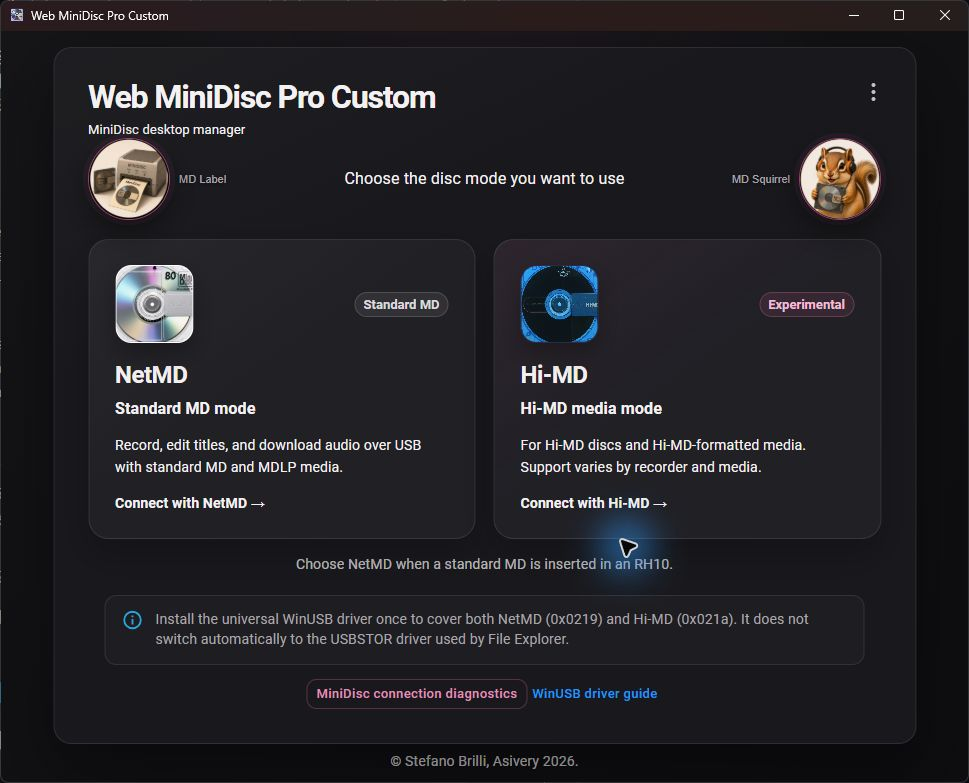
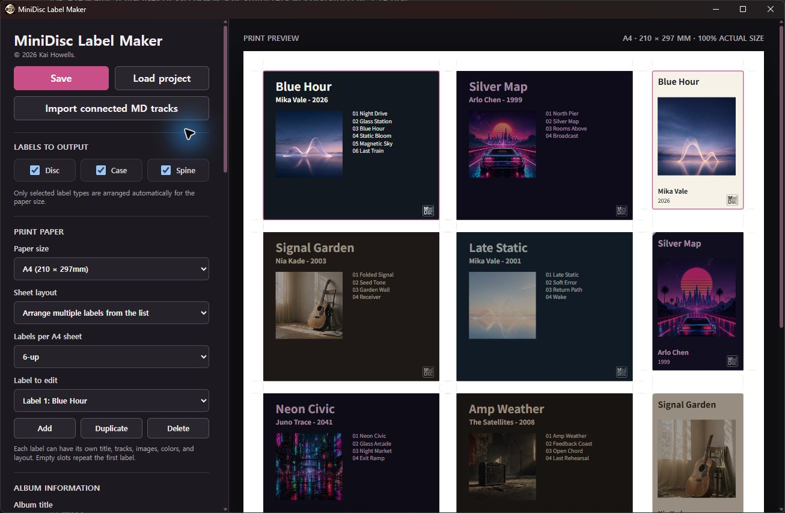

# Windows user guide

[한국어 안내](WINDOWS.md)

This guide covers installation, the WinUSB driver, NetMD and Hi-MD workflows,
transfer finalization, troubleshooting, and building Web MiniDisc Pro Custom
on Windows.



## Release status

- Supported systems: 64-bit Windows 10 and Windows 11
- Latest public ZIP: [Windows Custom R8](https://github.com/run240/web-minidisc-pro-custom/releases/tag/windows-v1.5.4-r8)
- Distribution format: portable ZIP, not an installer
- Signing status: the application executable is not currently Authenticode-signed

The `main` branch has moved beyond the R8 tag. It now includes the new
application icon, security-runtime updates, a startup-loop fix, and improved
Hi-MD finalization timing for the MZ-RH10 on Windows. Until another Windows
release is published, the R8 ZIP and the current `main` branch are not identical.

## Before you start

- Back up irreplaceable recordings.
- Use a charged battery or stable external power during recording, editing,
  formatting, and finalization.
- Prefer a known data-capable cable connected directly to the PC instead of a hub.
- Close SonicStage, OpenMG, other MiniDisc software, and File Explorer windows
  using the recorder.
- Do not disconnect USB or power while the app shows 99%, the recorder flashes
  `REC`, or a format operation is in progress.

## Download and run

1. Download the Windows x64 ZIP and its matching SHA-256 file from Releases.
2. Compare the ZIP hash with the value in the checksum file.
3. Extract the entire ZIP into a new folder. Do not run the EXE from inside the ZIP.
4. Run `Web MiniDisc Pro.exe`.
5. Select **Settings → Language** to choose English, 한국어, or automatic system language.

PowerShell example:

```powershell
Get-FileHash -Algorithm SHA256 '.\Web-MiniDisc-Pro-*-Windows-x64.zip'
```

Windows SmartScreen or Smart App Control may block an unsigned build. Verify
the source and checksum before running it. Do not disable Windows security
features globally just to run this application.

## Understanding WinUSB

The current USB interface of a NetMD or Hi-MD recorder must use WinUSB for this
application. The app inspects the connected USB ID and driver, then offers to
install WinUSB only when required.

With the user's approval, the app runs Windows' `certutil.exe` and
`pnputil.exe` with administrator privileges. It adds the self-signed
`Web MiniDisc Pro WinUSB Test Driver` certificate to the Local Machine Root and
Trusted Publishers stores, then registers the bundled MiniDisc driver package.

Important details:

- The universal package contains all supported USB IDs, but Windows may still
  need time to apply it when a recorder first appears in another USB mode.
- Recorders such as the MZ-RH10 expose different IDs for NetMD (`0x0219`) and
  Hi-MD (`0x021a`). Confirm the selected mode and detected device details.
- WinUSB and File Explorer's `USBSTOR` driver do not switch automatically. A
  Hi-MD volume using WinUSB will not simultaneously appear as a normal drive.
- Review and approve the UAC prompt yourself. Do not disconnect USB during installation.

## First connection

1. Insert the disc and connect the recorder over USB.
2. Choose **Connect with NetMD** for standard MD/MDLP media, or **Connect with
   Hi-MD** for Hi-MD-formatted and dedicated 1 GB Hi-MD media.
3. If several devices are connected, choose one by model and USB location.
4. If prompted, verify the device, mode, and USB ID before installing WinUSB.
5. After a mode switch, driver change, or app restart, wait for the recorder to
   reappear. Reconnect the cable once and select the same mode if necessary.

Use **MiniDisc connection diagnostics** to inspect the model, USB ID, USB
location, detected mode, and active driver.

## NetMD workflow

Use NetMD with standard 60/74/80-minute MD and MDLP media for recording,
title/group editing, and supported downloads.

1. Insert a standard MD and choose **Connect with NetMD**.
2. After the disc list appears, add audio and select a supported recording format.
3. Keep the recorder connected until recording and TOC finalization have completed.
4. After applying temporary title, group, or order edits, rescan the disc and
   verify the stored result.

A Hi-MD-formatted disc may look empty in NetMD mode. Recording in that state
can rewrite the media and destroy existing Hi-MD data. Cancel and reconnect in
Hi-MD mode whenever the media format is uncertain.

## Hi-MD workflow

Use Hi-MD for listing, editing, deleting, and uploading to Hi-MD-formatted
standard media and dedicated 1 GB Hi-MD media.

1. Insert Hi-MD media and choose **Connect with Hi-MD**.
2. Wait for the filesystem and track list to load.
3. After audio conversion and payload transfer, allow the recorder to finish
   its metadata, FAT, and ICV authentication updates.
4. Wait for the completion message, then verify the track list and playback.

### Why 99% can take a while

100% file conversion and 99% device transfer are different stages. At 99%, the
recorder can still be committing its track database, filesystem, and ICV data.
An observed MZ-RH10 finalization took approximately 50 seconds.

- If `REC` is flashing or the recorder is active, choose **Wait longer**.
- Use **Copy diagnostics** when the stalled-transfer notice appears.
- The app does not automatically replay an uncertain final command because it
  may already have been accepted by the recorder.
- After an error, reconnect and check whether the track already exists before
  uploading it again.
- Current `main` allows up to 60 seconds for a slow Windows MZ-RH10 Hi-MD final response.

## Media modes and formatting

Switching USB mode and formatting media are not the same operation.

- **Switch to NetMD/Hi-MD only** changes the USB interface and does not
  immediately erase the disc. A later recording in the wrong format can still
  rewrite the media.
- **Format as Hi-MD** deletes every track and title on a standard MD and creates
  a Hi-MD filesystem.
- **Format as standard MD** deletes all Hi-MD data and initializes the disc for NetMD.
- Dedicated 1 GB Hi-MD media cannot be converted to standard MD.

Before formatting, re-check the target model and USB ID and connect only the
one recorder you intend to format. Do not remove the disc, USB, or power before
the completion message.

## Editing and companion tools

- NetMD and Hi-MD title, album, artist, order, and group changes can be staged
  and applied together. Rescan afterward to verify the actual disc state.
- **MD Label** designs disc, case, and spine labels and exports PDF, PNG, SVG,
  or project files. It can import the connected disc's track list.
- **MD Squirrel** creates English-tagged copies in a sibling `[English]` folder
  without re-encoding the source audio.



The [Korean guide](WINDOWS.md) contains separately captured Korean screenshots.

## Troubleshooting

### The app remains on the loading screen

Use Task Manager to close any remaining `Web MiniDisc Pro` processes from the
same build, then start it again. If the issue continues, extract the ZIP again
into a new folder.

### Recorder not found

1. Confirm the cable supports data, not charging only.
2. Remove USB hubs and try another port on the PC.
3. Close SonicStage, OpenMG, and other MiniDisc applications.
4. Open connection diagnostics and check the USB ID and driver.
5. Select the NetMD or Hi-MD mode that matches the inserted media.

### WinUSB installation does not finish

Check for a hidden UAC prompt, another driver installation, or software holding
the recorder open. Quit the app, reconnect USB or restart Windows, then retry
installation in the same mode.

### USB response timeout or stalled 99%

Wait until the recorder stops flashing `REC`. Restart the app or reconnect USB,
reload the track list, and check whether the track was already committed. An
immediate retry can create a duplicate track. Include the output from
**Copy diagnostics** when reporting the problem.

### Rescan is refused

The app blocks rescans during recording, downloading, edit application, or
formatting to avoid filesystem and TOC conflicts. Wait for the active operation
to finish.

### Hi-MD filesystem not found

Choose NetMD when a standard MD is inserted. Do not choose a format action
unless you intend to erase the media. For existing Hi-MD media, reconnect in
Hi-MD USB mode and load the list again.

## Reverting WinUSB

Only do this when returning to a Sony driver, SonicStage, or File Explorer's
USB-storage mode. First make sure no other MiniDisc device still uses this package.

1. Find the MiniDisc recorder in Device Manager.
2. Remove the device and select driver removal if Windows offers that option.
3. Remove the test certificate from an elevated PowerShell window:

```powershell
certutil.exe -delstore Root "Web MiniDisc Pro WinUSB Test Driver"
certutil.exe -delstore TrustedPublisher "Web MiniDisc Pro WinUSB Test Driver"
```

Reconnect the recorder and follow the driver instructions for the application
you intend to use next.

## Build on Windows

Requirements:

- Node.js 22.12 or newer
- PowerShell 5.1 or newer
- Visual Studio 2022 Build Tools with Desktop development with C++
- Windows 10 or Windows 11 SDK

From an x64 Native Tools Command Prompt or prepared development environment:

```powershell
npm ci --legacy-peer-deps
npm run test:himd-edit-batch
npm run test:security-dependencies
npm run test:i18n
npm run pack:custom
npm run release:windows
```

The unpacked application is created under `build\win-unpacked`; verified ZIP
and SHA-256 files are written to `build\release`. To select a release label:

```powershell
.\scripts\package-windows-release.ps1 -ReleaseLabel '1.5.4-Custom-R9'
```

Before distribution, verify the real EXE, NetMD/Hi-MD connection, a complete
transfer on representative hardware, the ZIP checksum, and inclusion of
`MODIFIED-BUILD-NOTICE.txt`.
